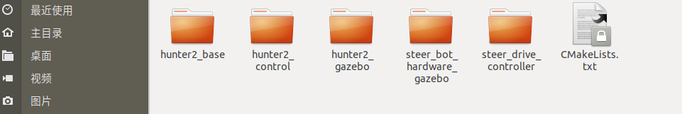

# hunter2.0仿真操作流程

## 一、功能包介绍


hunter2_base: 该文件夹为模型文件功能包

hunter2_control: 该文件为仿真控制器功能包

hunter2_gazebo: 该文件为gazebo仿真功能包

steer_bot_hardware_gazebo和steer_drive_controller均为阿克曼运动学ROS插件

## 二、环境

开发环境：ubuntu 18.04 + ROS Melodic desktop full

假如你没有安装ROS，请按照官网的教程安装ROS

ROS安装完成之后，按照下面的指令下载依赖：

```
sudo apt-get install ros-melodic-ros-control
sudo apt-get install ros-melodic-ros-controllers
sudo apt-get install ros-melodic-gazebo-ros
sudo apt-get install ros-melodic-gazebo-ros-control
sudo apt-get install ros-melodic-teleop-twist-keyboard	
sudo apt-get install ros-melodic-rqt-robot-steering 
```

## 三、用法

### 第一步、创建工作空间并下载功能包

打开一个新终端，创建一个新的工作空间，在终端中输入：

```
mkdir hunter_ws/src
cd hunter_ws/src
catkin_init_workspace
git clone https://github.com/agilexrobotics/ugv_sim.git
cd ..
rosdep install --from-paths src --ignore-src -r -y 
catkin_make
```

### 第二步、运行hunter2.0的启动文件，在Rviz中可视化urdf文件

```
cd hunter_ws
source devel/setup.bash
#启动hunter2.0
roslaunch hunter2_base display_xacro.launch
```


### 第三步、运行hunter2_gazebo的启动文件，并在gazebo中控制hunter2.0运动

```
cd hunter_ws
source devel/setup.bash
#启动hunter2.0仿真环境
roslaunch hunter2_gazebo hunter2_gazebo.launch
```


通过Robot Steering 小插件控制hunter2.0运动


