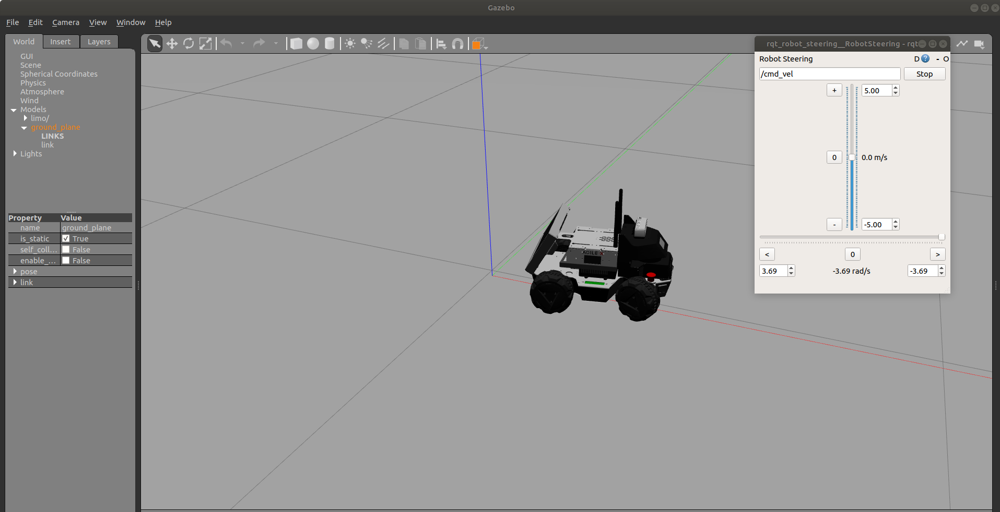
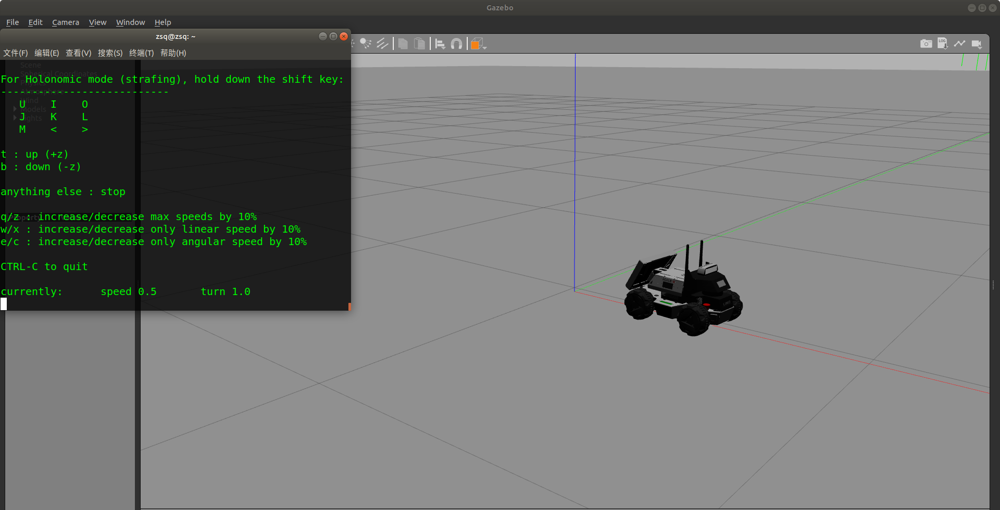

[TOC]

# Limo Simulation Operation Process

## 1.	Introduction of Function Package

```
├── image
├── limo_description
├── limo_gazebo_sim
```

​	limo_description: The file is the function package of model file

​	limo_gazebo_sim: The folder is gazebo simulation function package

## 2.	Environment

### Development Environment

​	ubuntu 18.04 + [ROS Melodic desktop full](http://wiki.ros.org/melodic/Installation/Ubuntu)

### Download and install required function package

​	Download and install ros-control function package, ros-control is the robot control middleware provided by ROS

```
sudo apt-get install ros-melodic-ros-control
```

​	Download and install ros-controllers function package, ros-controllers are the kinematics plug-in of common models provided by ROS

```
sudo apt-get install ros-melodic-ros-controllers
```

​	Download and install gazebo-ros function package, gazebo-ros is the communication interface between gazebo and ROS, and connect the ROS and Gazebo

```
sudo apt-get install ros-melodic-gazebo-ros
```

​	Download and install gazebo-ros-control function package, gazebo-ros-control is the communication standard controller between ROS and Gazebo

```
sudo apt-get install ros-melodic-gazebo-ros-control
```

​	Download and install joint-state-publisher-gui package.This package is used to visualize the joint control.

```
sudo apt-get install ros-melodic-joint-state-publisher-gui 
```

​	Download and install rqt-robot-steering plug-in, rqt_robot_steering is a ROS tool closely related to robot motion control, it can send the control command of robot linear motion and steering motion, and the robot motion can be easily controlled through the sliding bar

```
sudo apt-get install ros-melodic-rqt-robot-steering 
```

​	Download and install teleop-twist-keyboard function package, telop-twist-keyboard is keyboard control function package, the robot can be controlled to move forward, left, right and backward through "i", "j", "l",and "," on the keyboard

```
sudo apt-get install ros-melodic-teleop-twist-keyboard 
```


## 3.	About Usage

### 1.	Create workspace, download simulation model function package and compile

​		Open a new terminal and create a workspace named limo_ws, enter in the terminal:

```
mkdir limo_ws
```

​		Enter the limo_ws folder

```
cd limo_ws
```

​		Create a folder to store function package named src
```
mkdir src
```

​		Enter the src folder

```
cd src
```

​		Initialize folder

```
catkin_init_workspace
```

​		Download simulation model function package

```
git clone https://github.com/agilexrobotics/ugv_sim.git
```

​		Enter the limo_ws folder

```
cd limo_ws
```

​		Confirm whether the dependency of the function package is installed

```
rosdep install --from-paths src --ignore-src -r -y 
```

​	Compile

```
catkin_make
```


### 2.	Run the star file of limo model and visualize the urdf file in Rviz

​	Enter the limo_ws folder

```
cd limo_ws
```

​	Declare the environment variable

```
source devel/setup.bash
```

​	Run the start file of limo and visualize the model in Rviz

```
roslaunch limo_description display_models.launch 
```

 

### 3.	Start the gazebo simulation environment of limo and control limo movement in the gazebo

​	Enter the limo_ws folder

```
cd limo_ws
```

​	Declare the environment variable

```
source devel/setup.bash
```

​	Start the simulation environment of limo, limo have two movement mode, the movement mode is Ackerman mode

```
roslaunch limo_gazebo_sim limo_ackerman.launch
```

​	Start rqt_robot_steering movement control plug-in, the sliding bar can control the robot motion

```
rosrun rqt_robot_steering rqt_robot_steering
```

 

Four-wheel differential steering movement mode

```
roslaunch limo_gazebo_sim limo_four_diff.launch 
```

Control by keyboard, the robot can be controlled to move forward, left, right and backward through "i", "j", "l",and "," on the keyboard

```
rosrun teleop_twist_keyboard teleop_twist_keyboard.py 
```

 

 

 
