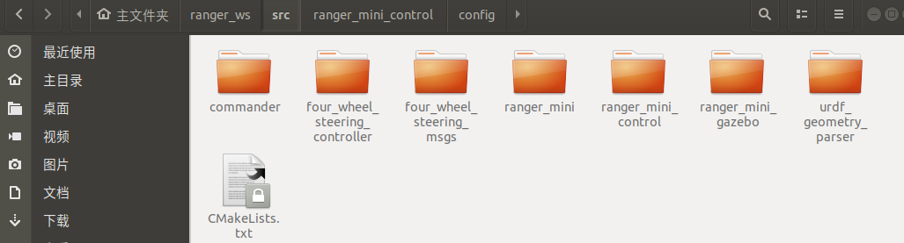

ranger_mini仿真操作流程

一、功能包介绍

 

ranger_mini: 该文件夹为模型文件功能包

ranger_mini: 该文件夹为仿真控制器功能包

ranger_mini_gazebo: 该文件夹为gazebo仿真功能包

commander、four_wheel_steering_controller、four_wheel_steering_msgs和urdf_geometry_parser均为四轮四转运动学ROS插件

二、环境

开发环境：ubuntu 18.04 + ROS Melodic desktop full。

假如你没有安装ROS，请按照官网的教程安装ROS。

ROS安装完成之后，按照下面的指令下载依赖：

sudo apt-get install ros-melodic-ros-control

sudo apt-get install ros-melodic-ros-controllers

sudo apt-get install ros-melodic-gazebo-ros

sudo apt-get install ros-melodic-gazebo-ros-control

sudo apt-get install ros-melodic-teleop-twist-keyboard	

三、用法

第一步、创建工作空间并下载功能包

打开一个新终端，创建一个新的工作空间，在终端中输入：

mkdir ranger_mini_ws/src

cd ranger_mini_ws/src

catkin_init_workspace

git clone 

cd ..

rosdep install --from-paths src --ignore-src -r -y  

catkin_make

第二步、运行ranger_mini的启动文件，在Rviz中可视化urdf文件

cd ranger_mini_ws

source devel/setup.bash

\#启动ranger_mini

roslaunch ranger_mini display_xacro.launch 

第三步、启动ranger_mini_gazebo的启动文件，并在gazebo中控制ranger_mini运动

cd ranger_mini_ws

source devel/setup.bash

\#启动ranger_mini 仿真环境

roslaunch ranger_mini_gazebo launch_simulation.launch

 

通过Robot Steering 小插件控制ranger_mini运动

 

