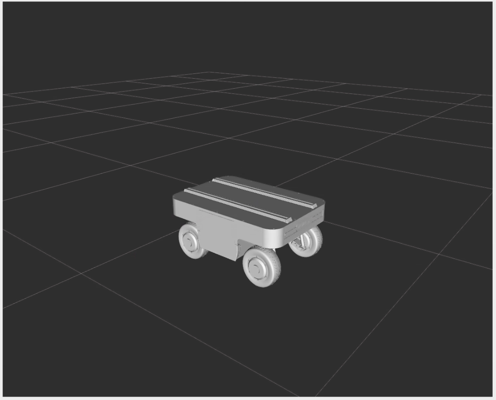
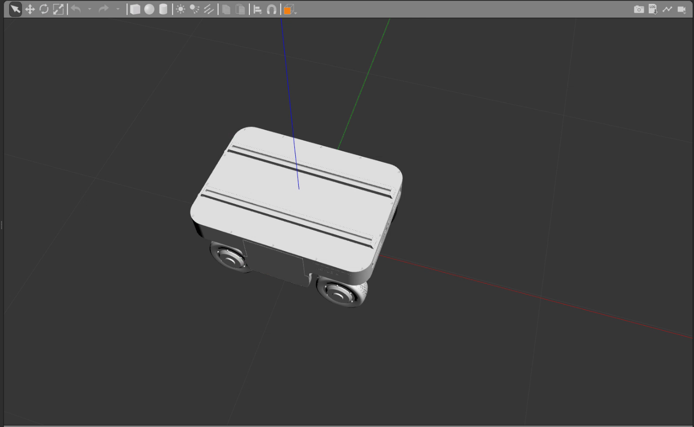

[TOC]

# Ranger_min_V2 Simulation Operation Process

Ranger_min_V2 仿真过程

## 1.Introduction of Function Package

```
├── ranger_mini
├── four_ws_control
```

​	ranger_mini: The folder is model file function package

​	four_ws_control: The file is  the controller of the model

## 2.Environment

### Development Environment

​	Ubuntu 22.04  + [ROS Humble desktop full](http://docs.ros.org/en/humble/Installation.html)

### Download and install required function package

​	Download and install gazebo-ros function package, gazebo-ros is the communication interface between gazebo and ROS, and connect the ROS and Gazebo

```
sudo apt-get install ros-humble-gazebo-*
```

​	Download and install joint-state-publisher-gui joint-state-publisher package.This package is used to visualize the joint control.

```
sudo apt-get install ros-humble-joint-state-publisher ros-humble-joint-state-publisher-gui
```

​	Download and install ackermann-steering controller; The ackermann-steering controller is a gazebo plugin for controlling the car

```
sudo apt-get install ros-humble-ackermann-steering-controller
```

​	Download and install Control-related dependencies and feature packs; control is used to define the type of model joints

```
sudo apt-get install ros-humble-control-*
```

​	Download and install rqt-robot-steering plug-in, rqt_robot_steering is a ROS tool closely related to robot motion control, it can send the control command of robot linear motion and steering motion, and the robot motion can be easily controlled through the sliding bar

```
sudo apt-get install ros-humble-rqt-robot-steering 
```


## 3.About Usage

### 	1.Create workspace, download simulation model function package and compile

​		Open a new terminal and create a workspace named ranger_ws, enter in the terminal:

```
mkdir ranger_ws
```

​		Enter the ranger_ws folder

```
cd ranger_ws
```

​		Create a folder to store function package named src

```
mkdir src
```

​		Enter the src folder

```
cd src
```

​		Download simulation model function package

```
git clone https://github.com/agilexrobotics/ugv_sim.git -b humble
```

​		Enter the ranger_ws folder

```
cd ranger_ws
```

​	Due to the large size of some models, they cannot be uploaded to GitHub directly. Therefore, the models have been compressed. After downloading, you will need to extract the models.

```
cd ranger_ws/src/ugv_gazebo_sim/ranger/ranger_mini/meshes
unzip ranger_base.zip
```

​	Because a yaml file needs to be invoked in the gazebo simulation, the absolute path is used, which needs to be modified according to the actual path

​	Open the ranger_mini_gazebo.xacro file and modify the following path. Replace the path in the red box with the path in the actual computer


​	Compile

```
colcon build 
```

### 	2.Run the star file of hunter2.0 model and visualize the model in Rviz

​		Enter the ranger_ws folder

```
cd ranger_ws
```

​		Declare the environment variable

```
source install/setup.bash 
```

​		Run the start file of hunter2.0 and visualize the model in Rviz

```
ros2 launch ranger_mini ranger_mini_v2_display.launch.py 
```



### 	3.Start the gazebo simulation environment of hunter2.0 and control hunter2.0 movement in the gazebo

​		Enter the ranger_ws folder

```
cd ranger_ws
```

​		Declare the environment variable

```
source install/setup.bash 
source /usr/share/gazebo-11/setup.bash
```

​		Start the simulation environment of hunter se, slide the sliding bar of Robot Steering plug-in to control robot movement

```
ros2 launch ranger_mini ranger_mini_v2_gazebo.launch.py 
```

​	Activate  Robot Steering plugI-in

```
ros2 run rqt_robot_steering rqt_robot_steering 
```



