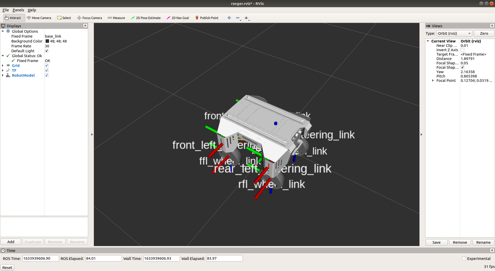
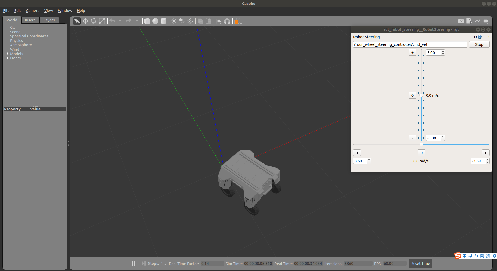

[TOC]

# Ranger_mini Simulation Operation Process

## 1.	Introduction of Function Package

'''
├── four_wheel_steering_controller
├── four_wheel_steering_msgs
├── ranger_mini
├── ranger_mini_control
├── ranger_mini_gazebo
└── urdf_geometry_parser
'''

​	ranger_mini: The folder is model file function package

​	ranger_mini_control: The folder is simulation controller function package

​	ranger_mini_gazebo: The folder is Gazebo simulation function package

​	our_wheel_steering_controller: The folder is four-wheel four-steering controller function package

​	four_wheel_steering_msgs: The folder is four-wheel four-steering message function package
​	urdf_geometry_parser : The folder is urdf resolver

​	[four_wheel_steering](http://wiki.ros.org/four_wheel_steering_controller)、[four_wheel_steering_msgs](http://wiki.ros.org/four_wheel_steering_msgs)、[urdf_geometry_parser](http://wiki.ros.org/urdf_geometry_parser)are provided for official website

## 2.	Environment

### Development Environment

​	ubuntu 18.04 + [ROS Melodic desktop full](http://wiki.ros.org/melodic/Installation/Ubuntu)

### Download and install required function package

​	Download and install ros-control function package, ros-control is the robot control middleware provided by ROS

```
sudo apt-get install ros-melodic-ros-control
```

​	Download and install ros-controllers function package, ros-controllers are the kinematics plug-in of common models provided by ROS

```
sudo apt-get install ros-melodic-ros-controllers
```

​	Download and install gazebo-ros function package, gazebo-ros is the communication interface between gazebo and ROS, and connect the ROS and Gazebo

```
sudo apt-get install ros-melodic-gazebo-ros
```

​	Download and install gazebo-ros-control function package, gazebo-ros-control is the communication standard controller between ROS and Gazebo

```
sudo apt-get install ros-melodic-gazebo-ros-control
```

​	Download and install joint-state-publisher-gui package.This package is used to visualize the joint control.

```
sudo apt-get install ros-melodic-joint-state-publisher-gui 
```

​	Download and install rqt-robot-steering plug-in, rqt_robot_steering is a ROS tool closely related to robot motion control, it can send the control command of robot linear motion and steering motion, and the robot motion can be easily controlled through the sliding bar

```
sudo apt-get install ros-melodic-rqt-robot-steering 
```


## 3.	About Usage

### 	1.	Create workspace, download simulation model function package and compile

​		Open a new terminal and create a workspace named ranger_mini_ws, enter in the terminal:

```
mkdir ranger_mini_ws
```

​		Enter the ranger_ws folder

```
cd ranger_mini_ws
```

​		Create a folder to store function package named src

```
mkdir src
```

​		Enter the src folder

```
cd src
```

​		Initialize folder

```
catkin_init_workspace
```

​		Download simulation model function package

```
git clone https://github.com/agilexrobotics/ugv_sim.git
```

​		Enter the ranger_mini_ws folder

```
cd ranger_mini_ws
```

​		Confirm whether the dependency of the function package is installed

```
rosdep install --from-paths src --ignore-src -r -y 
```

​		Compile

```
catkin_make
```


### 2.	Run the star file of ranger_mini model and visualize the urdf file in Rviz

​	Enter the ranger_mini_ws folder

```
cd ranger_mini_ws
```

​	Declare the environment variable

```
source devel/setup.bash
```

​	Run the start file of ranger_mini and visualize the model in Rvi

```
roslaunch ranger_mini display_xacro.launch 
```



### 3、3.	Start the gazebo simulation environment of ranger_mini and control ranger_mini movement in the gazebo

​	Enter the ranger_mini_ws

```
cd ranger_mini_ws
```

​	Declare the environment variable

```
source devel/setup.bash
```

Start the simulation environment of ranger_mini, slide the sliding bar of Robot Steering plug-in to control robot movement

```
roslaunch ranger_mini_gazebo ranger_mini_empty_world.launch
```

 


 

